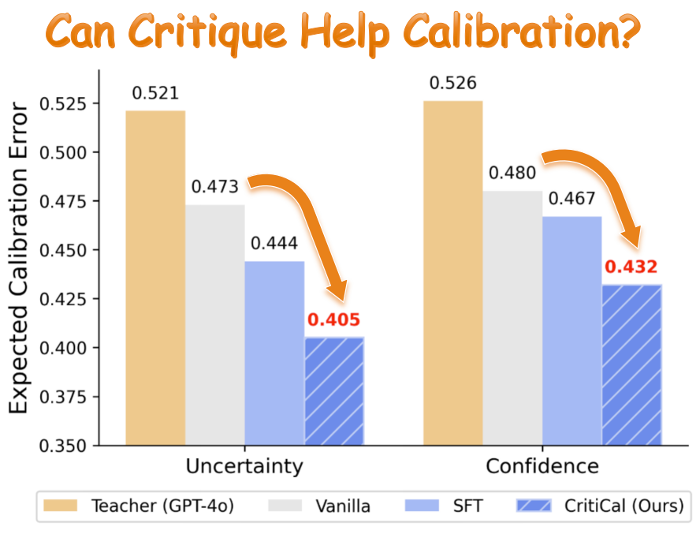
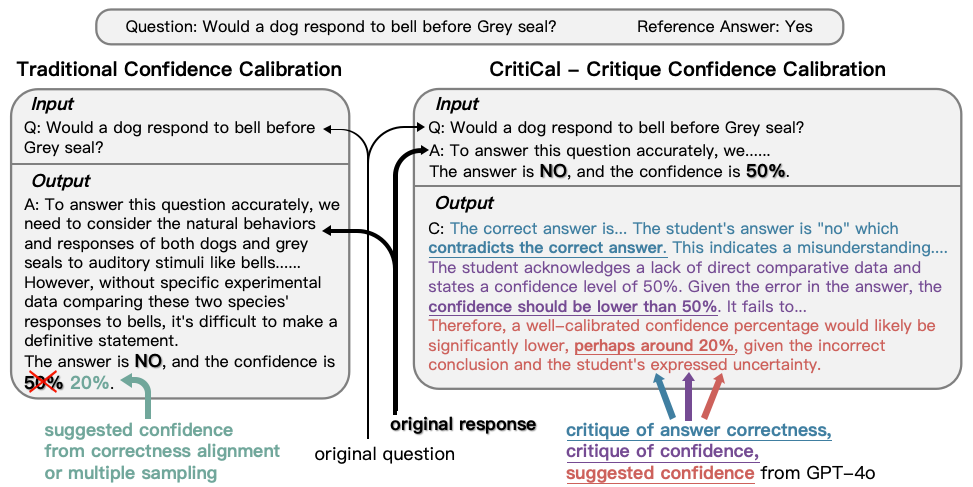

# CritiCal: Can Critique Help LLM Uncertainty or Confidence Calibration?

This repository is the official implementation of *CritiCal: Can Critique Help LLM Uncertainty or Confidence Calibration?*.

## Abstract

Accurate confidence calibration in Large Language Models (LLMs) is critical for safe use in high-stakes domains, where clear verbalized confidence enhances user trust. Traditional methods that mimic reference confidence expressions often fail to capture the reasoning needed for accurate confidence assessment. We propose natural language critiques as a solution, ideally suited for confidence calibration, as precise gold confidence labels are hard to obtain and often require multiple generations. This paper studies how natural language critiques can enhance verbalized confidence, addressing: (1) What to critique: uncertainty (question-focused) or confidence (answer-specific)? Analysis shows confidence suits multiple-choice tasks, while uncertainty excels in open-ended scenarios. (2) How to critique: self-critique or critique calibration training? We propose Self-Critique, enabling LLMs to critique and optimize their confidence beyond mere accuracy, and CritiCal, a novel Critique Calibration training method that leverages natural language critiques to improve confidence calibration, moving beyond direct numerical optimization. Experiments show that CritiCal significantly outperforms Self-Critique and other competitive baselines, even surpassing its teacher model, GPT-4o, in complex reasoning tasks. CritiCal also shows robust generalization in out-of-distribution settings, advancing LLM's reliability.

## Results



## Pipeline



## Requirements

You can install all requirements with the command:

```
pip install -r requirements.txt
```

## Benchmark

We provide `strategyqa` and `math_perturb` under `./benchmark` for quick start. For other benchmarks, you can download them following instructions in `./benchmark/readme.md`.

## Training

We train CritiCal using [LLaMA-Factory](https://github.com/hiyouga/LLaMA-Factory). You should first clone the repository, and then put the two files `./llama_factory/dataset_info.json` and `./llama_factory/qwen_lora_sft.yaml` under `./LLaMA-Factory/data` and `./LLaMA-Factory/examples/train_lora`, respectively.

First, generate initial models response for the training data. We use vLLM library due to its efficiency.

```
export CUDA_VISIBLE_DEVICES=0. # choose a free gpu id
vllm serve Qwen/Qwen2.5-7B-Instruct --port 8020  # choose a free port
```

After server completion, we generate model response in a new screen:

```
cd critique
python baseline_all_vllm.py --task strategyqa --input_file ../benchmark/strategyqa/split_train_2000.json --mode unc --run_mode vanilla --port 8020 --output_path ../experiments/strategyqa/split_train_2000_Qwen25_7B_Instruct_unc.json
```

After the completion of model response generation, use Ctrl+C to shutdown the server in the scree before.

If you fail to find the screen, you can also find the server PID using `ss -tulnwp | grep 8020` and `kill PID`.

Then, generate the critique date for CritiCal:

```
cd critique
python gen_critique_all.py --input_file ../experiments/strategyqa/split_train_2000_Qwen25_7B_Instruct_unc.json --task  strategyqa  --origin_model Qwen/Qwen2.5-7B-Instruct --api_key YOUR_API_KEY
```

The training and validation data will be generated under `../experiments/critique_train/` by default. Write their path into the above `./LLaMA-Factory/data/dataset_info.json` file.

Finally, we can use LLaMA-Factory to train CritiCal:

```
cd ../llama_factory
chmod +x qwen_sft.sh
./qwen_sft.sh
```

Logs and models will be generated under `./LLaMA-Factory/logs` and `./LLaMA-Factory/saves` by default.

## Evaluation

To evaluate the fine-tuned model, we first use vllm to serve it.

```
cd ..
vllm serve Qwen/Qwen2.5-7B-Instruct --enable-lora --lora-modules ./LLaMA-Factory/saves/strategyqa_qwen_unc/checkpoint-xx --port 8021 
```

After server completion, we generate model response in a new screen:

```
cd critique
python baseline_all_vllm.py --task strategyqa --mode unc --run_mode vanilla --port 8021
```

After the completion of model response generation, remember to shutdown the server as before.